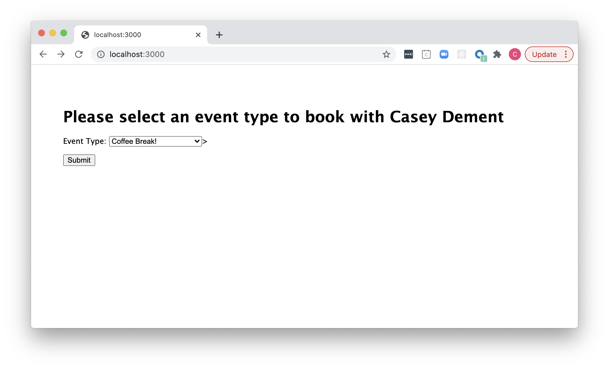
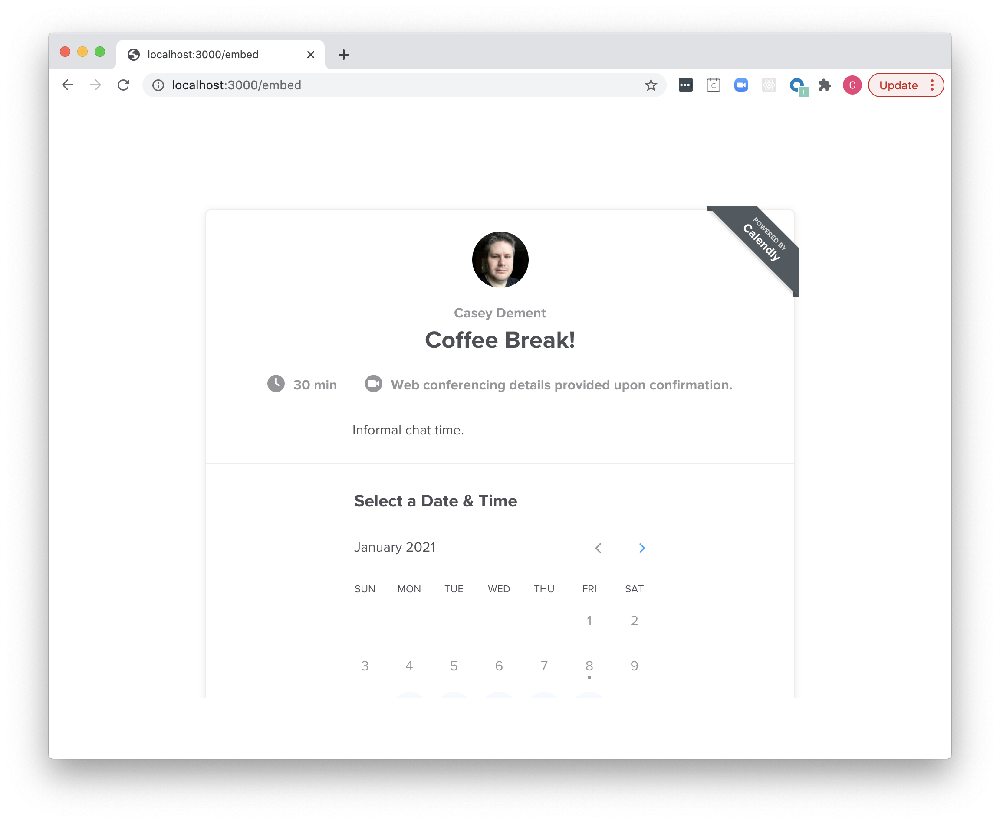

# Calendly Dynamic Embed Demo
This project demonstrates how to include a dynamic Calendly booking embed in your website.

## Usage
To use this demo, you must first get your Calendly API Key.  Please follow the instructions at:

* https://calendly.stoplight.io/docs/api-docs-v1/docs/C-Get-Auth-Token.md

Once you have your API Key, you can run this demo locally using the following instructions:

```
npm install

API_KEY=**YOUR API KEY** npm start
```

Where "**YOUR API KEY**" is replaced with the value obtained above.  This should display a simple form that allows you to select from your available defined event types, similar to:



Select from the available event types and submit the form.  You should then be shown a page containing the embed for the selected event type from which you can book an event, similar to:



## How does it work?
This implementation is based on the following steps:

1. When the root landing page is generated, the application queries the Calendly API to get your user details and list of available event types.  This information is used to compose a list of available event types and their associated URL.  This is done in the file `/routes/index.js`.
2. When you select an event type and submit, the appropriate event type URL is sumbitted to the `/embed` page.  This is done in the `/views/index.hbs` template.
3. The embed page uses Calendly's standard "Inline Embed" code to render the selected event type, substituting the event type URL that was submitted from the root landing page.  This is accomplished in the `/views/embed.hbs` template.